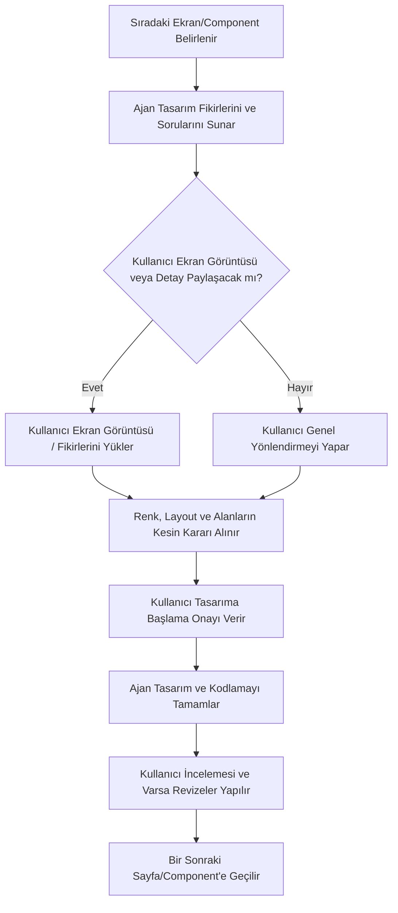

# AVLU34 Tasarım ve Geliştirme Yol Haritası (Roadmap)

Bu doküman, AVLU34 web sitesinin UI/UX tasarımı ve frontend geliştirme sürecinin adım adım planını içerir.

> [!IMPORTANT]
> **Tasarım ve Geliştirme Protokolü:**
> Ajan (AI), listedeki **hiçbir sayfa veya bileşenin (component) tasarımına/kodlamasına doğrudan başlayamaz**. Her adım öncesinde kullanıcı ile detaylar tartışılacak, gerekirse ekran görüntüleri talep edilecek veya kullanıcı tarafından sunulacak, renk/yerleşim kararları ortaklaşa alındıktan sonra kullanıcı onayı ile kodlamaya geçilecektir.

---

## 🗺️ Adım Adım Tasarım ve Uygulama Akışı

### Adım 1: Global Bileşenler (Header, Footer ve Sanity Navigasyon Güncellemesi)

- **Header (Gezinti Çubuğu):**
  - 2 katmanlı (Layer 1: Logo/Dil/Arama/İletişim; Layer 2: Ana Menü Linkleri), beyaz arka planlı, net sınırlı minimalist yapı.
  - Hover durumunda aşağı açılan ve Sanity'de manuel girilen alt linkleri listeleyen **Mega Menü** tasarımı.
  - Mobil cihazlar için hamburger menü yerleşimi.
- **Footer (Alt Bilgi):**
  - Üst kısımda koyu afiş zeminli "AVLU34'te Neler Yeni?" tanıtım şeridi.
  - Orta/alt kısımda 4 kolonlu minimalist site haritası, e-bülten kaydı, sosyal medya butonları ve iletişim alanı.
- **Sanity Navigasyon Şeması Güncellemesi:**
  - `src/sanity/schemaTypes/singletons/navigation.ts` şemasına mega menü alt kırılımlarını (subLinks) daha esnek ve manuel yönetebilecek alanların eklenmesi.

---

### Adım 2: Ana Sayfa (Home Page) Tasarımı & Bileşenleri

Ana sayfa tasarımı parçalara bölünerek tek tek tartışılacak ve onay alındıkça kodlanacaktır:

1.  **Full-Screen Hero Carousel:** Drag/swipe (sürükle-bırak) destekli, ok yönlü ve sol altta dinamik çalışma saati / kat planı hızlı linki barındıran büyük slider bileşeni.
2.  **Hızlı Erişim Paneli:** Grid biçiminde 6 ana sayfa linki (Mağazalar, Yeme-İçme, Kat Planı vb.).
3.  **Öne Çıkan Kampanyalar & Etkinlikler Alanı:** Dubai Mall'daki gibi ikiye bölünmüş (split) zemin veya yan yana büyük kart yerleşimleri.
4.  **Mağaza Keşif Izgarası:** Popüler kategorilerin ikonlu/görselli şık kutuları.
5.  **Sinema Keyfi Vitrini:** Sinema sayfasına yönlendiren görselli tanıtım alanı.
6.  **Ziyaret ve Konum Alanı:** Ulaşım, otopark, çalışma saatleri ve harita yerleşimi.

---

### Adım 3: Mağazalar ve Yeme-İçme Sayfaları

1.  **Mağazalar Hub Sayfası (`/magazalar`):** Arama çubuğu, kategori/kat filtreleri, minimalist saf beyaz logolu mağaza kartları ızgarası.
2.  **Mağaza Detay Sayfası (`/magazalar/[slug]`):** Mağaza konsept resmi/cephenin büyük görseli, çalışma saatleri ve iletişim bilgileri listesi, ilişkili aktif kampanyaların kartları.
3.  **Yeme-İçme Hub Sayfası (`/yeme-icme`):** Restoran, kafe ve fast-food kategorilerini içeren mağaza kartı yapısının yemek hub'ına uyarlanmış hali.

---

### Adım 4: Kampanyalar ve Etkinlikler Sayfaları

1.  **Kampanyalar Hub Sayfası (`/kampanyalar`):** Aktif kampanyaların büyük renkli kartları; süresi geçmiş kampanyaların en altta siyah-beyaz (grayscale) ve pasif olarak listelenmesi.
2.  **Kampanya Detay Sayfası (`/kampanyalar/[slug]`):** Kampanya detay metni (RichText), kampanya şartları, ilişkili mağazaya giden "Mağazayı Gör" CTA butonu.
3.  **Etkinlikler Hub & Detay Sayfaları (`/etkinlikler`):** Aktif/geçmiş etkinliklerin listelenmesi, konum/saat bilgileri ve etkinlik detayında yer alacak fotoğraf galerisi (Lightbox).

---

### Adım 5: Sabit ve Yardımcı Sayfalar

1.  **Sinema Sayfası (`/sinema`):** AVM sinema salonu deneyimi, özellikleri ve dış seans sağlayıcıya yönlendiren bilet alma butonu.
2.  **Kat Planı Sayfası (`/kat-plani`):** Kat haritası görselleri ve PDF indirme butonları.
3.  **Ziyaret Planı Sayfası (`/ziyaret-plani`):** Detaylı ulaşım tarifleri, otopark bilgisi ve bebek bakım, mescit gibi AVM hizmetleri listesi.
4.  **İletişim Sayfası (`/iletisim`):** Çalışan `ContactForm` entegrasyonu, harita yerleşimi ve iletişim numaraları.
5.  **Hakkımızda (`/hakkimizda`) & KVKK (`/kvkk`):** Tamamen metin odaklı yasal/tanıtım sayfalarının monokrom şık dizaynı.

---

### Adım 6: 404 Sayfasi

## 🛠️ Her Adımda Uygulanacak Tasarım Protokolü (İletişim Akışı)

